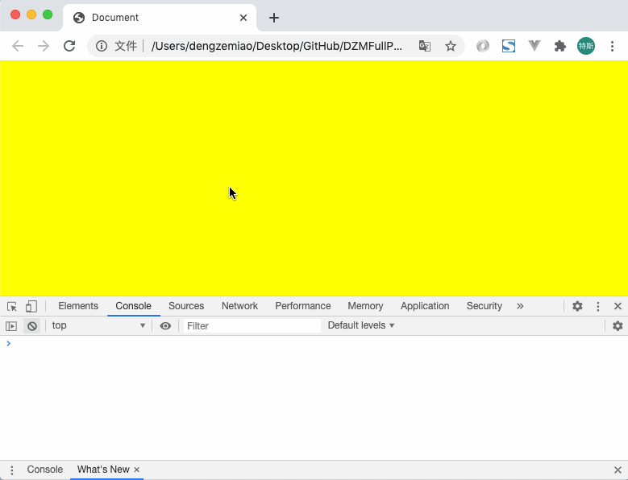

# DZMFullPage

可用于做Web网页分段页面动态添加展示动画，兼容了IE9及以上版本

***

可用于做类似这样的效果：


***

Demo 效果：



***

通过 npm 引入

```
npm i dzm-full-page
```

然后在 main.js 中进行导入

```
import Vue from 'vue'
import App from './App.vue'
import router from './router'
import store from './store'

import fullPage from 'dzm-full-page'
Vue.prototype.$fullPage = fullPage

Vue.config.productionTip = false

new Vue({
  router,
  store,
  render: h => h(App)
}).$mount('#app')
```

vue 文件中使用

```
<template>
  <div class="home">
    <!-- 分页指定DOM -->
    <div id="full-page">
      <!-- 页 -->
      <div style="width: 100%; height: 300px; background-color: yellow;"></div>
      <!-- 页 -->
      <div style="width: 100%; padding: 10px; margin: 10px; background-color: orange;">
        <div style="height: 100px;"></div>
      </div>
      <!-- 页 -->
      <div style="width: 100%; background-color: red;">
        <div style="height: 100px; padding: 10px; margin: 10px;"></div>
      </div>
      <!-- 页 -->
      <div style="width: 100%; height: 300px; background-color: blue;"></div>
      <!-- 页 -->
      <div style="width: 100%; height: 300px; background-color: blueviolet;"></div>
      <!-- 页 -->
      <div style="width: 100%; height: 300px; background-color: yellowgreen;"></div>
    </div>
  </div>
</template>

<script>

export default {
  mounted () {
    // 获取需要进行监听分页的DOM
    var target = document.getElementById('full-page')
    // 监听页码
    this.$fullPage(target, {
      // 获取每个子元素头部出现多少可见区域才算可见（小于1: 按子元素本身高度的百分比计算px, 大于1: 按px进行计算，默认为0）
      // callbackVisibleHeaderScales: function (index, rect) {
      //   // 按px传入
      //   // return 10
      //   // 按比例传入
      //   return 0.2
      // },

      // 获取每个子元素尾部出现多少可见区域才算可见（小于1: 按子元素本身高度的百分比计算px, 大于1: 按px进行计算，默认为0）
      // callbackVisibleFooterScales: function (index, rect) {
      //   // 按px传入
      //   // return 10
      //   // 按比例传入
      //   return 0.2
      // },

      // 回调函数 - 返回可见子元素列表
      // callbackVisibles: function (visibleIndexs, childrens) {
      //   console.log(visibleIndexs, childrens)
      // },

      // 回调函数 - 子元素首次显示回调，之后重复显示将不再回调
      // callbackVisiblesOnce: function (index, isVisible, childrens) {
      //   console.log(index, isVisible, childrens[index])
      // },

      // 回调函数
      callback: function (index, isVisible, visibleIndexs, childrens) {
        console.log(index, isVisible, visibleIndexs, childrens[index])
      }
    })
  }
}
</script>
```


***

 通过 <script> 引入使用

```
<!DOCTYPE html>
<html lang="en">
<head>
  <meta charset="UTF-8">
  <meta name="viewport" content="width=device-width, initial-scale=1.0">
  <title>Document</title>
  <style>
    /* 清空原样式 */
    html, body {
      padding: 0;
      margin: 0;
    }
  </style>
</head>
<body>
  <!-- 分页指定DOM -->
  <div id="full-page">
    <!-- 页 -->
    <div style="width: 100%; height: 300px; background-color: yellow;"></div>
    <!-- 页 -->
    <div style="width: 100%; padding: 10px; margin: 10px; background-color: orange;">
      <div style="height: 100px;"></div>
    </div>
    <!-- 页 -->
    <div style="width: 100%; background-color: red;">
      <div style="height: 100px; padding: 10px; margin: 10px;"></div>
    </div>
    <!-- 页 -->
    <div style="width: 100%; height: 300px; background-color: blue;"></div>
    <!-- 页 -->
    <div style="width: 100%; height: 300px; background-color: blueviolet;"></div>
    <!-- 页 -->
    <div style="width: 100%; height: 300px; background-color: yellowgreen;"></div>
  </div>
  <!-- 导入插件 -->
  <script src="./fullPage.js"></script>
  <script>
    // 获取需要进行监听分页的DOM
    var target = document.getElementById('full-page')
    // 监听页码
    fullPage(target, {

      // 获取每个子元素头部出现多少可见区域才算可见（小于1: 按子元素本身高度的百分比计算px, 大于1: 按px进行计算，默认为0）
      // callbackVisibleHeaderScales: function (index, rect) {
      //   // 按px传入
      //   // return 10
      //   // 按比例传入
      //   return 0.2
      // },

      // 获取每个子元素尾部出现多少可见区域才算可见（小于1: 按子元素本身高度的百分比计算px, 大于1: 按px进行计算，默认为0）
      // callbackVisibleFooterScales: function (index, rect) {
      //   // 按px传入
      //   // return 10
      //   // 按比例传入
      //   return 0.2
      // },

      // 回调函数 - 返回可见子元素列表
      // callbackVisibles: function (visibleIndexs, childrens) {
      //   console.log(visibleIndexs, childrens)
      // },

      // 回调函数 - 子元素首次显示回调，之后重复显示将不再回调
      // callbackVisiblesOnce: function (index, isVisible, childrens) {
      //   console.log(index, isVisible, childrens[index])
      // },

      // 回调函数
      callback: function (index, isVisible, visibleIndexs, childrens) {
        console.log(index, isVisible, visibleIndexs, childrens[index])
      }
    })
  </script>
</body>
</html>
```
